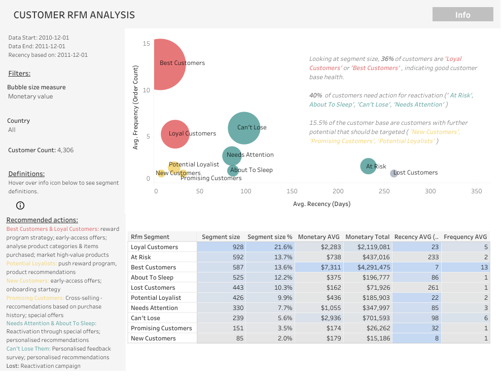

# Project: Customer RFM Analysis - Recency, Frequency, Monetary

--------------------------------------------
## Project Objective

Objective for this procjet was to conduct a RFM analysis on customer data to segment customers based on their recency, frequency and monetary values for the business. Based on the the analysis, to then provide an overview of customer segments and recommendations on actions to take for each segment. 

**Questions this project aimed to answer:**
1. How does the distribution of customers per customer segment look like for the business?
2. What general insights does the RFM analysis provide on the health of the customer base?
3. What specific insights and actions can be concluded for specific customer segments?

**Tools used**
SQL in BigQuery, Google Sheets, Tableau

## Project Content

**BigQuery RFM Analysis - Exploratory analysis.sql** - SQL file containing the exploratory analysis and data cleaning/ preparation steps taken in BigQuery to retrieve the required data from the dataset

[**Project Workbook**](https://docs.google.com/spreadsheets/d/1cDMaozbVZX27zTgDyNcvjFjmHycgW_TGUn6W0shxBP4/edit?usp=sharing) - Google Sheets workbook containing project overview, SQL code and segment definitions

## Data & Context

**Data Source:** [Turing College rfm datatable](https://console.cloud.google.com/bigquery?ws=!1m5!1m4!4m3!1stc-da-1!2sturing_data_analytics!3srfm)

**Data Timeframe:** 
Start: 2010-12-01 
End: 2011-12-01

**Metrics:**
- Recency (R) – period since last purchase.
- Frequency (F) – number of transactions.
- Monetary (M) – total money spent

## Output

RFM Customer Segmentation Dashboard

